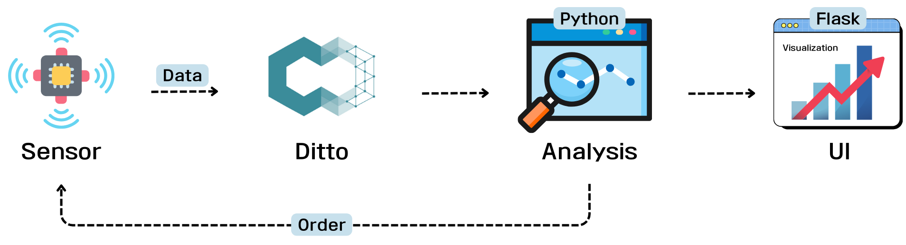
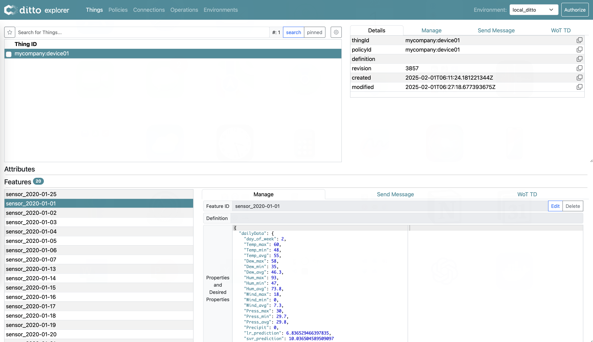
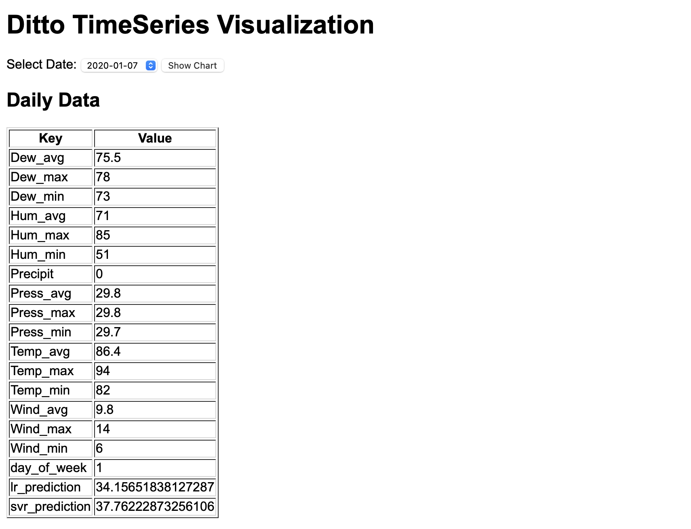
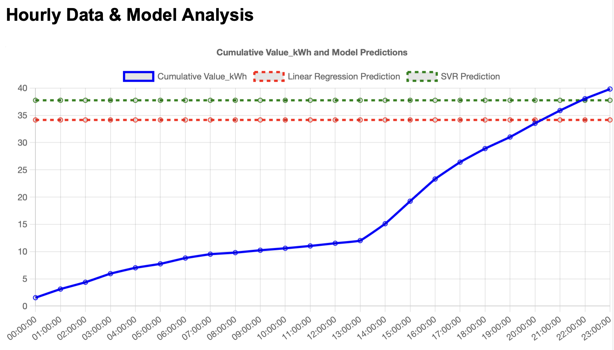

# 🔌 Ditto + Transformer 기반 전력 예측 시스템

이 프로젝트는 **Eclipse Ditto**를 활용하여 전력 및 기상 데이터를 수집하고,  
전력 소비 예측을 위해 **Linear Regression, SVR 기반 모델**을 적용하는 디지털 트윈 시스템입니다.  
예측 결과는 Ditto의 **Feature Store**에 저장되며, Flask 및 React 기반의 UI를 통해 데이터를 시각화할 수 있습니다.

 

---

### Ditto 
  

### UI
<p align="center">
  
  
</p>

<br>

## 🚀 실행 방법

### 1. Docker로 Ditto + MongoDB + Nginx 실행

터미널에서 아래 명령어로 Docker 컨테이너를 실행합니다.

```bash
docker compose up -d
docker compose ps
```

Ditto Dashboard는 브라우저에서 http://localhost:8080/ui/를 통해 확인할 수 있습니다.

<br>

### 2. Ditto Policy 및 Thing 생성

만약 Policy가 아직 없다면, 아래 JSON으로 Policy를 먼저 생성할 수 있습니다.
예제에서는 nginx:ditto 사용자에게 READ/WRITE 권한을 부여합니다.

**Policy 지정**
```bash
curl -u "ditto:ditto" \
  -X PUT \
  -H "Content-Type: application/json" \
  -d '{
    "entries": {
      "nginx:ditto": {
        "subjects": {
          "nginx:ditto": {
            "type": "ditto"
          }
        },
        "resources": {
          "thing:/": {
            "grant": ["READ", "WRITE"],
            "revoke": []
          },
          "policy:/": {
            "grant": ["READ", "WRITE"],
            "revoke": []
          }
        }
      }
    }
  }' \
  http://localhost:8080/api/2/policies/mycompany:device01
```

<br>

#### Difficulty
>💡 왜 “revoke” 필드가 필요할까요?  
Ditto의 Policy JSON은 “grant”와 “revoke”를 명시적으로 구분하여,
누가(Subjects)이 무엇(Resources)에 대해 어떤 권한(READ/WRITE)을 가질지 설정합니다.
일부 버전에서는 두 필드를 모두 포함해야 정상 동작합니다.

<br>

**Thing 생성**
```bash
curl -u "ditto:ditto" \
  -X PUT \
  -H "Content-Type: application/json" \
  -d '{"policyId": "mycompany:device01"}' \
  http://localhost:8080/api/2/things/mycompany:device01
```
정상 동작 여부를 확인하려면 아래와 같이 테스트합니다.
```bash
curl -v -u "ditto:ditto" \
  -X PUT \
  -H "Content-Type: application/json" \
  -d '{
    "properties": {
      "temp": 25
    }
  }' \
  http://localhost:8080/api/2/things/mycompany:device01/features/sensor
```
성공 시 아래와 같은 응답이 반환됩니다.
```bash
{"properties":{"temp":25}}
```

<br>

### 3. Transformer 기반 모델 학습

전력 및 기상 데이터를 기반으로 예측 모델을 학습합니다.
현재 예측 모델로는 Linear Regression과 SVR을 사용하며,
추후 Transformer 기반 모델로 확장할 수 있습니다.
```bash
python training.py
```
학습 완료 후, 다음 파일들이 result/ 또는 static/result/에 저장됩니다.
	•	scaler_X.pkl (입력 데이터 스케일러)
	•	scaler_y.pkl (타깃 데이터 스케일러)
	•	transformer_model.pth (또는 linear_regression_model.pkl, svr_pipeline_model.pkl)

<br>

### 4. Ditto에 전력/기상 데이터 전송

전력 및 날씨 데이터를 일정 주기(예: 10분 간격)로 Ditto에 전송합니다.
sand_data.py (또는 send_data.py)를 실행하면,
각 날짜별로 sensor_<YYYY-MM-DD> Feature가 생성되고,
dailyData와 hourlyData, 모델 예측값(lr_prediction, svr_prediction)이 업데이트됩니다.
```bash
python sand_data.py
```

<br>

### 5. 사용자 데이터 조회 및 시각화

Flask 기반의 API 및 UI를 통해 Ditto에 저장된 데이터를 조회하고 시각화합니다.
```bash
python show_data.py
```
	•	API 사용 예시:
	•	GET /api/dates : 저장된 날짜 목록 반환
	•	GET /api/date/<DATE> : 특정 날짜의 전력 및 날씨 데이터 반환
	•	UI 사용:
브라우저에서 http://localhost:8085/에 접속 후,
날짜를 선택하여 dailyData(예: 기상 정보, 예측값)와 누적 전력 사용량(Value_kWh) 및 예측 선(Linear Regression, SVR)을 확인할 수 있습니다.


<br>

### 📌 Docker 및 기타 명령어

#### Docker 컨테이너 실행
```bash
docker compose up -d
```
#### Docker 컨테이너 상태 확인
```bash
docker compose ps
```

<br>

**💡 추가 참고**  
	•	Ditto Explorer  
브라우저에서 http://localhost:8080/ui/에 접속하여,  
Thing ID: mycompany:powerDevice (또는 mycompany:device01)를 확인하고,  
Feature(예: sensor, prediction)를 직접 조회할 수 있습니다.  
	•	API 예제  
```bash
curl -X GET http://localhost:8085/api/date/2020-01-01
```
**응답 예시:**  
```bash
{
    "dailyData": {
        "Temp_max": 60,
        "Temp_avg": 55.0,
        "Temp_min": 48,
        "lr_prediction": 6.84,
        "svr_prediction": 10.04
    },
    "hourlyData": [
        { "timestamp": "00:00:00", "Value_kWh": 0.181 },
        { "timestamp": "01:00:00", "Value_kWh": 0.144 },
        ...
    ]
}
```

<br>

### 🖥 개발 환경  
•	기본 언어: Python (3.9+)  
•	디지털 트윈 플랫폼: Eclipse Ditto  
•	데이터베이스: MongoDB  
•	UI: Flask, React.js, Chart.js  
•	개발 환경: macOS (Apple Silicon M3)  
•	컨테이너: Docker Compose (Ditto, MongoDB, Nginx)


<br>

### 🚀 실행 순서 요약  
1.	Docker로 Ditto + MongoDB + Nginx 구동  
•	docker compose up -d  
2.	Policy/Thing 생성  
•	위의 Policy 지정 및 Thing 생성 절차 수행  
3.	모델 학습  
•	python training.py  
4.	데이터 전송  
•	python sand_data.py  
5.	사용자 UI 실행 (Flask 기반)  
•	python show_data.py → http://localhost:8085/  

<br>

### 🔧 FAQ  
 
**Q1. 학습된 모델을 재사용하려면?**  
	•	결과 파일(transformer_model.pth, linear_regression_model.pkl, svr_pipeline_model.pkl)과 스케일러 파일을 유지하면, 재학습 없이 모델을 바로 로드하여 예측할 수 있습니다.

**Q2. Ditto에 데이터가 정상적으로 저장되었는지 확인하는 방법은?**  
	•	http://localhost:8080/ui/에서 Ditto Explorer를 통해 Thing과 Feature 정보를 확인하거나,  
	•	API 호출로 GET /api/2/things/mycompany:powerDevice/features/sensor_<DATE>/properties를 통해 확인할 수 있습니다.

**Q3. 데이터 전송 주기를 빠르게 테스트하려면?**  
	•	sand_data.py의 interval 값을 600(10분)에서 1 또는 2초로 변경하여 테스트할 수 있습니다.

<br>

### 📎 참고 문서  
•	Eclipse Ditto 공식 문서  
•	Docker Compose 공식 문서  
•	Chart.js 공식 문서  
•	MongoDB 공식 문서  

### 🚀 프로젝트 핵심 요약  
•	Docker로 Ditto + MongoDB + Nginx 실행  
•	전력 및 기상 데이터를 Ditto로 전송 및 저장  
•	Transformer(및 비교 모델) 기반 예측을 통한 전력 소비 예측  
•	Flask + React 기반 UI에서 데이터 시각화  
•	API 및 Ditto Explorer 연동을 통한 데이터 관리  

